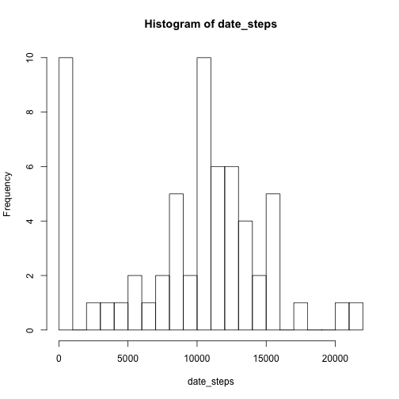
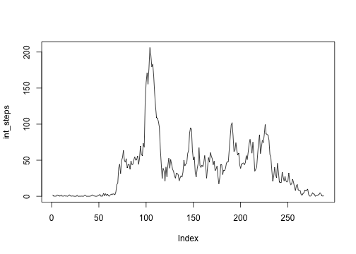

# Reproducible Research: Peer Assessment 1
## Dennis Noren


```r
if (!require("knitr")) {
  install.packages("knitr", repos="http://cran.rstudio.com/") 
  library("knitr")
}
if (!require("ggplot2")) {
  install.packages("ggplot2", repos="http://cran.rstudio.com/") 
  library("ggplot2")
}
```

```
## Loading required package: ggplot2
```

## Load and preprocess the data
### Preprocessing is to count total steps by day

```r
setwd("~/Documents/R/repR/PA1")
activity <- read.csv("activity.csv", header=TRUE)
#activity$interval <- factor(as.character(activity$interval))
# preprocessing for day of week
activity$dayOfWeek <- weekdays(as.Date(activity$date))
dayW <- c("Sunday","Monday","Tuesday","Wednesday"
          ,"Thursday","Friday","Saturday")
dayT <- c("Weekend","Weekday","Weekday","Weekday"
        ,"Weekday","Weekday","Weekend")
activity$dayType <- factor(dayT[match(activity$dayOfWeek, dayW)])

# NA values to be exclused from computations
date_steps <- tapply(activity$steps, activity$date, sum, na.rm = TRUE)
```

## Data on total number of steps taken per day

```r
hist(date_steps, breaks=20)
```

 

```r
st_mean <- mean(date_steps, na.rm=TRUE)
st_med <- median(date_steps, na.rm=TRUE)
```

Mean total steps per day is 9354.2295.

Median total steps per day is 10395.

## What is the average daily activity pattern?

```r
int_steps <- tapply(activity$steps, activity$interval, mean, na.rm = TRUE)
plot(int_steps, type='l')
```

 

```r
maxSteps <- max(int_steps)
# I could not determine how to reference the interval IDs correctly
# This was even after converting to data frame
```
The maximum number of steps in an interval is 206.1698

The interval in which that ocurred is 835, determined by inspection.

## Imputing missing values

```r
# would like to impute interval means for all steps = NA values
# without figuring out how to use interval IDs, cannot do this
# could not figure out how to manipulate and apply output of tapply
```
## Are there differences in activity patterns between weekdays and weekends

```r
# Not enough time to do this
# without figuring out how to use interval IDs, cannot do this
# here are counts of weekdays vs. weekends
table(activity$dayType)
```

```
## 
## Weekday Weekend 
##   12960    4608
```
